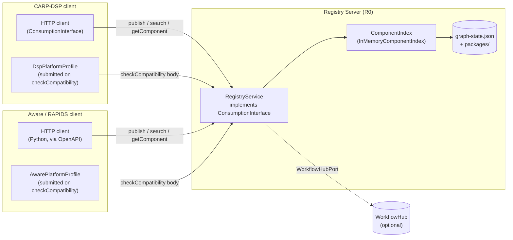

# health-workflow-interfaces

`health-workflow-interfaces` is a platform-neutral shared contract library for digital health workflow interoperability.
It defines the types, interfaces, and evaluation logic that allow independent research platforms to publish, discover, and consume computational workflows from one another — without coupling to any single platform's internals.

This library is the result of a collaboration between the [Copenhagen Research Platform (CARP)](https://www.carp.dk/) and the [Aware/RAPIDS](https://www.awareframework.com/) project.
It is used by [CARP-DSP](https://github.com/carp-dk/carp-dsp) as its reference implementation, and by Aware/RAPIDS as the basis for its consumption adapter.
Any platform wishing to participate in the interoperability layer can do so by implementing the interfaces defined here — no dependency on CARP-DSP or Aware internals is required.

Two key **design goals** guide this project:

- **Platform neutrality**: No type, interface, or constraint in this library is specific to CARP-DSP, Aware, or any other platform. All platforms are equal implementors.
- **Contract as code**: The interfaces here are the interoperability standard. A platform that compiles against them and passes the conformance scenarios is, by definition, interoperable.

## Table of Contents

- [Architecture](#architecture)
  - [Workflow Artifact Package](docs/workflow-models.md)
  - [Consumption Interface](docs/consumption-interface.md)
  - [Component Index](docs/component-index.md)
  - [Platform Profile](docs/platform-profile.md)
  - [Package Deserialiser](docs/package-deserialiser.md)
  - [Compatibility Evaluator](docs/compatibility-evaluator.md)
  - [OpenAPI Specification](#openapi-specification)
  - [CARP Domain Profile](#carp-domain-profile)
- [Implementing a Platform](#implementing-a-platform)
- [Usage](#usage)
- [Development](#development)

## Architecture

The library is organised around four core concepts: a **unit of exchange** (`WorkflowArtifactPackage`), a **shared API contract** (`ConsumptionInterface`), a **component graph** (`ComponentIndex`), and a **platform capability declaration** (`PlatformProfile`).
Supporting components handle serialization, compatibility evaluation, and optional metadata for open science registries.



### Workflow Artifact Package

[`WorkflowArtifactPackage`](docs/workflow-models.md) is the portable unit exchanged between platforms.
It bundles a workflow definition in its native format alongside translations to [Common Workflow Language (CWL)](https://www.commonwl.org), supporting scripts, [RO-Crate](https://www.researchobject.org/ro-crate/) metadata, dependency declarations, and an optional execution snapshot.
Its `PackageMetadata` also carries semantic descriptors (granularity, inputs/outputs, methods, and data sensitivity) to support richer discovery and governance.

See [docs/workflow-models.md](docs/workflow-models.md) for full field documentation, supporting types, and enumeration values.

### Component Index

[`ComponentIndex`](docs/component-index.md) is the graph query interface for indexing and traversing component relationships.
When a package is published, it is indexed into a node/edge graph: workflow nodes, step nodes, data type nodes, and method nodes are created and linked by typed edges (`CONTAINS`, `DEPENDS_ON`, `IMPLEMENTS`, etc.).
This graph powers semantic discovery and lineage traversal across all published components.

`InMemoryComponentIndex` is the R1 implementation, backed by an adjacency map with JSON persistence — graph state is serialised to `data/graph-state.json` and restored on server restart without re-indexing.
The server persists this file via a temp-file + replace move strategy so repeated publishes work reliably on Windows too.

See [docs/component-index.md](docs/component-index.md) for the full node/edge type reference, indexing rules, and persistence examples.

### Consumption Interface

[`ConsumptionInterface`](docs/consumption-interface.md) is the API contract that every participating platform implements.
It covers the full lifecycle of a workflow package: publishing, discovery, retrieval, dependency resolution, compatibility checking, DOI minting, and lineage.
Discovery via `search` supports both basic filters (keywords/tags/format) and semantic filters derived from package metadata.

See [docs/consumption-interface.md](docs/consumption-interface.md) for full operation documentation, supporting types, and request/response objects.

The machine-readable OpenAPI contract is available at [`openapi.yaml`](openapi.yaml).

### Platform Profile

[`PlatformProfile`](docs/platform-profile.md) is a serializable data class that a client submits as the body of a `checkCompatibility` request to declare its capabilities — supported workflow formats, environment types, script languages, and operational constraints.
The server has no registry of known platforms; each client is responsible for constructing and sending its own profile.
The `CompatibilityReport` returned describes the outcome alongside `CompatibilitySignal` and any `AdaptationHint` values.

See [docs/platform-profile.md](docs/platform-profile.md) for full field documentation and type definitions.

### Package Deserialiser

[`PackageDeserialiser`](docs/package-deserialiser.md) provides shared logic for loading a `WorkflowArtifactPackage` from a zip archive or a directory on disk.
`DefaultPackageDeserialiser` reads the `package.json` manifest, validates the SHA-256 content hash against the archive contents, and deserialises the full package object graph.
Both CARP-DSP and Aware can use it without taking a dependency on each other's internals.

See [docs/package-deserialiser.md](docs/package-deserialiser.md) for the hash algorithm, zip format, and usage examples.

### Compatibility Evaluator

[`CompatibilityEvaluator`](docs/compatibility-evaluator.md) is a stateless component that compares a `WorkflowArtifactPackage` against a `PlatformProfile` and produces a `CompatibilityReport`.
`DefaultCompatibilityEvaluator` checks workflow format support (BLOCKING) and script language support (WARNING), then derives an overall signal of `COMPATIBLE`, `COMPATIBLE_WITH_ADAPTATIONS`, or `INCOMPATIBLE`.

See [docs/compatibility-evaluator.md](docs/compatibility-evaluator.md) for evaluation rules, signal derivation logic, and usage examples.

### OpenAPI Specification

An OpenAPI 3.1 specification for the `ConsumptionInterface` REST API is provided at [`openapi.yaml`](openapi.yaml).
Platforms can use this to generate HTTP clients without taking a Kotlin dependency on `health-workflow-interfaces`.

The spec covers all seven operations, includes example payloads for `getComponent`, `search`, and `checkCompatibility`, and passes `spectral lint` (OAS ruleset) with zero errors.
A `.spectral.yaml` at the repo root pins the ruleset for repeatable local linting:

```bash
npx @stoplight/spectral-cli lint openapi.yaml
```

### CARP Domain Profile

A JSON-LD context file (`profiles/carp-profile.jsonld`) maps CARP-specific workflow terms to standard vocabularies (schema.org, Bioschemas, RO-Crate).
This is referenced in the `RoCrateMetadata` of packages published by CARP-DSP and enables WorkflowHub compatibility.

> TODO: finalise profile URL and WorkflowHub submission instructions

## Implementing a Platform

To participate in the interoperability layer, a platform needs to:

1. Depend on this library (Kotlin) or generate a client from `openapi.yaml` (any language)
2. Implement `ConsumptionInterface` — or point at the shared server via the OpenAPI client
3. Implement `PlatformProfile` declaring the platform's supported formats, environments, and constraints
4. Use `PackageDeserialiser` to load incoming packages
5. Use `CompatibilityEvaluator` to respond to `checkCompatibility` calls

Platforms that use the shared server (R0) only need to implement the OpenAPI client and a `PlatformProfile`. The `ComponentIndex` is managed server-side.

> TODO: add a minimal implementation walkthrough with code examples

## Usage

> TODO: add dependency coordinates once publishing is configured

> TODO: add a short end-to-end example (publish from CARP-DSP, consume from Aware adapter)

## Development

> TODO: document build instructions, Gradle tasks, and contribution guidelines
