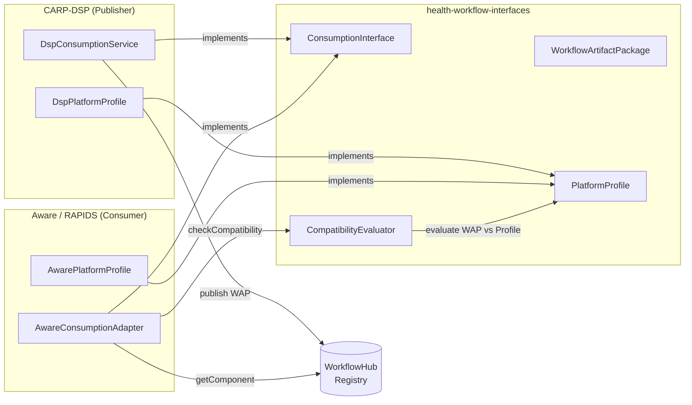

# health-workflow-interfaces

`health-workflow-interfaces` is a platform-neutral shared contract library for digital health workflow interoperability.
It defines the types, interfaces, and evaluation logic that allow independent research platforms to publish, discover, and consume computational workflows from one another — without coupling to any single platform's internals.

This library is the result of a collaboration between the [Copenhagen Research Platform (CARP)](https://www.carp.dk/) and the [Aware/RAPIDS](https://www.awareframework.com/) project.
It is used by [CARP-DSP](https://github.com/carp-dk/carp-dsp) as its reference implementation, and by Aware/RAPIDS as the basis for its consumption adapter.
Any platform wishing to participate in the interoperability layer can do so by implementing the interfaces defined here — no dependency on CARP-DSP or Aware internals is required.

Two key **design goals** guide this project:

- **Platform neutrality**: No type, interface, or constraint in this library is specific to CARP-DSP, Aware, or any other platform. All platforms are equal implementors.
- **Contract as code**: The interfaces here are the interoperability standard. A platform that compiles against them and passes the conformance scenarios is, by definition, interoperable.

## Table of Contents

- [Architecture](#architecture)
  - [Workflow Artifact Package](docs/workflow-models.md)
  - [Consumption Interface](#consumption-interface)
  - [Platform Profile](#platform-profile)
  - [Package Deserializer](#package-deserializer)
  - [Compatibility Evaluator](#compatibility-evaluator)
  - [OpenAPI Specification](#openapi-specification)
  - [CARP Domain Profile](#carp-domain-profile)
- [Implementing a Platform](#implementing-a-platform)
- [Usage](#usage)
- [Development](#development)

## Architecture

The library is organised around three core concepts: a **unit of exchange** (`WorkflowArtifactPackage`), a **shared API contract** (`ConsumptionInterface`), and a **platform capability declaration** (`PlatformProfile`).
Supporting components handle serialization, compatibility evaluation, and metadata for open science registries.

### Workflow Artifact Package

[`WorkflowArtifactPackage`](docs/workflow-models.md) is the portable unit exchanged between platforms.
It bundles a workflow definition in its native format alongside translations to [Common Workflow Language (CWL)](https://www.commonwl.org), supporting scripts, [RO-Crate](https://www.researchobject.org/ro-crate/) metadata, dependency declarations, and an optional execution snapshot.

See [docs/workflow-models.md](docs/workflow-models.md) for full field documentation, supporting types, and enumeration values.

### Consumption Interface

`ConsumptionInterface` is the API contract that every participating platform implements.
It covers the full lifecycle of a workflow package: publishing, discovery, retrieval, dependency resolution, compatibility checking, DOI minting, and lineage.

| Operation             | Description                                      |
|-----------------------|--------------------------------------------------|
| `getComponent`        | Retrieve a package by id and version             |
| `search`              | Discover packages matching a query               |
| `publish`             | Submit a package to the registry                 |
| `getDOI`              | Mint or retrieve a DOI for a package             |
| `resolveDependencies` | List all transitive dependencies                 |
| `checkCompatibility`  | Evaluate whether a package can run on a platform |
| `getLineage`          | Retrieve the provenance graph for a package      |

> TODO: link to OpenAPI spec once published

### Platform Profile

`PlatformProfile` is the interface a platform implements to declare its capabilities — supported workflow formats, environment types, script languages, and operational constraints.
It is used as input to `CompatibilityEvaluator` when checking whether an incoming package can run on a given platform.

> TODO: document CARP-DSP and Aware profile declarations

### Package Deserializer

`PackageDeserialiser` provides shared logic for loading a `WorkflowArtifactPackage` from a zip archive or directory, including content hash verification.
It is implemented once here so that both CARP-DSP and Aware can consume packages without duplicating deserialization logic.

> TODO: document usage and hash algorithm

### Compatibility Evaluator

`CompatibilityEvaluator` is a stateless component that compares a `WorkflowArtifactPackage` against a `PlatformProfile` and produces a `CompatibilityReport`.
The report includes an overall signal (`COMPATIBLE`, `COMPATIBLE_WITH_ADAPTATIONS`, or `INCOMPATIBLE`) and a list of `AdaptationHint` entries describing each mismatch.

> TODO: document evaluation rules and signal semantics

### OpenAPI Specification

An OpenAPI 3.1 specification for the `ConsumptionInterface` REST API is provided at `openapi.yaml`.
Platforms can use this to generate HTTP clients without taking a Kotlin dependency.

> TODO: publish spec and link here

### CARP Domain Profile

A JSON-LD context file (`profiles/carp-profile.jsonld`) maps CARP-specific workflow terms to standard vocabularies (schema.org, Bioschemas, RO-Crate).
This is referenced in the `RoCrateMetadata` of packages published by CARP-DSP and enables WorkflowHub compatibility.

> TODO: finalise profile URL and WorkflowHub submission instructions

## Implementing a Platform

To participate in the interoperability layer, a platform needs to:

1. Depend on this library
2. Implement `ConsumptionInterface` backed by the platform's workflow registry
3. Implement `PlatformProfile` declaring the platform's capabilities
4. Use `PackageDeserialiser` to load incoming packages
5. Use `CompatibilityEvaluator` to respond to `checkCompatibility` calls

> TODO: add a minimal implementation walkthrough with code examples

## Usage

> TODO: add dependency coordinates once publishing is configured

> TODO: add a short end-to-end example (publish from CARP-DSP, consume from Aware adapter)

## Development

> TODO: document build instructions, Gradle tasks, and contribution guidelines
