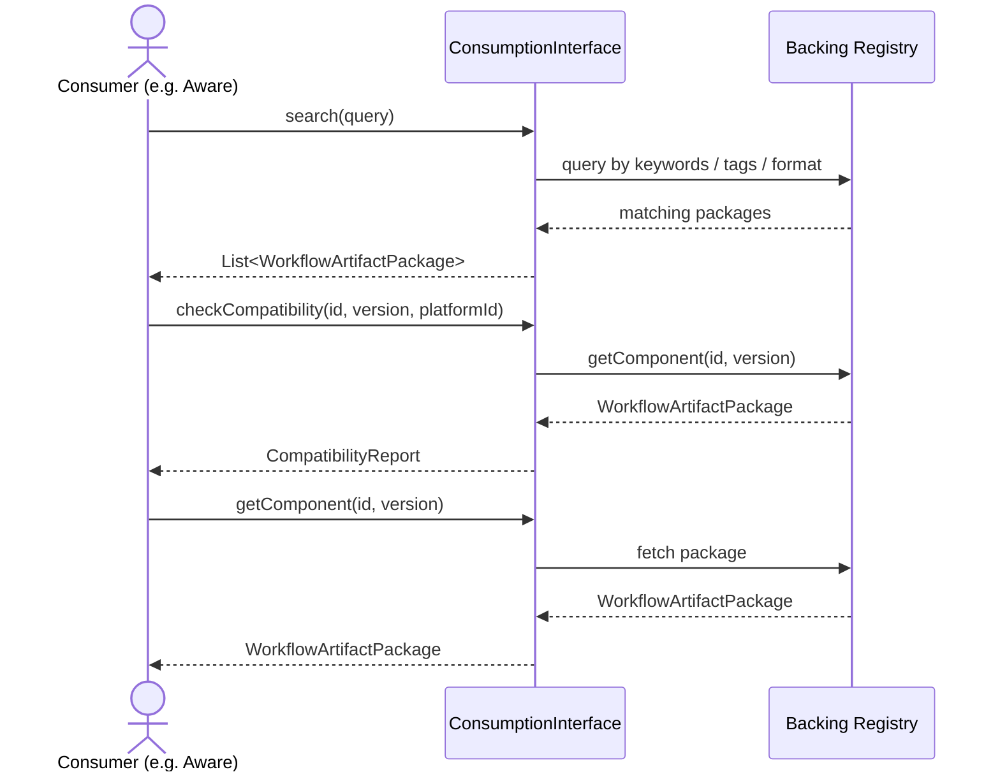

# Consumption Interface

[`ConsumptionInterface`](../lib/src/main/kotlin/carp/interfaces/api/ConsumptionInterface.kt) is the shared API contract that every participating platform implements.
It covers the full lifecycle of a workflow package: publishing, discovery, retrieval, dependency resolution, compatibility checking, DOI minting, and lineage.

Implementations may back these operations with local catalogues, remote services, or hybrid resolvers.
The interface is intentionally transport-agnostic — it contains no DSP-specific or Aware-specific behaviour.
All operations are `suspend` functions, so callers are expected to use Kotlin coroutines.

## Operations

### [`ConsumptionInterface`](../lib/src/main/kotlin/carp/interfaces/api/ConsumptionInterface.kt)

| Operation | Signature | Description |
|---|---|---|
| `getComponent` | `(id, version) → WorkflowArtifactPackage` | Retrieve a package by id and version. Implementations should fail when the package is not found. |
| `search` | `(query: SearchQuery) → List<WorkflowArtifactPackage>` | Find packages matching discovery criteria. Returns an empty list when there are no matches. |
| `publish` | `(pkg: WorkflowArtifactPackage) → PublishResult` | Publish a package into the backing registry. Implementations should validate package integrity. |
| `getDOI` | `(id, version) → String` | Resolve the DOI for a package. R1 implementations may throw `NotImplementedError`. |
| `resolveDependencies` | `(id, version) → List<ComponentRef>` | Resolve direct dependencies. Returns an empty list when no dependencies are declared. |
| `checkCompatibility` | `(id, version, platformId) → CompatibilityReport` | Live compatibility evaluation against a target platform. Results are computed at request time, not served from stale snapshots. |
| `getLineage` | `(id, version) → LineageGraph` | Retrieve lineage for a package. R1 implementations may return an empty graph. |

## Supporting types

### SearchQuery

Criteria for discovering workflow packages.

| Field | Type | Description |
|---|---|---|
| `keywords` | `List<String>` | Free-text keywords to match against name and description (default: empty) |
| `tags` | `List<String>` | Tags to filter by (default: empty) |
| `format` | `WorkflowFormat?` | Restrict results to a specific workflow format |
| `platformId` | `String?` | Restrict results to packages compatible with a specific platform |

### PublishResult

Outcome of a `publish` call.

| Field | Type | Description |
|---|---|---|
| `accepted` | `Boolean` | Whether the package was accepted by the registry |
| `id` | `String` | The id of the published package |
| `version` | `String` | The version of the published package |
| `message` | `String?` | Optional status or rejection message |

### CompatibilityReport

Result of a `checkCompatibility` call.

| Field | Type | Description |
|---|---|---|
| `compatible` | `Boolean` | Whether the package can run on the target platform |
| `reasons` | `List<String>` | Human-readable explanation of any incompatibilities (default: empty) |

### LineageGraph

Provenance graph for a workflow package.

| Field | Type | Description |
|---|---|---|
| `nodes` | `List<LineageNode>` | Packages in the lineage graph (default: empty) |
| `edges` | `List<LineageEdge>` | Directed relationships between packages (default: empty) |

#### LineageNode

| Field | Type | Description |
|---|---|---|
| `id` | `String` | Package identifier |
| `version` | `String` | Package version |

#### LineageEdge

| Field | Type | Description |
|---|---|---|
| `fromId` | `String` | Source package id |
| `fromVersion` | `String` | Source package version |
| `toId` | `String` | Target package id |
| `toVersion` | `String` | Target package version |
| `relation` | `String` | Relationship type (e.g. `derived-from`, `uses`) |

All request and response types are `@Serializable` and can be used to handle all operations through a single endpoint using type dispatch.
