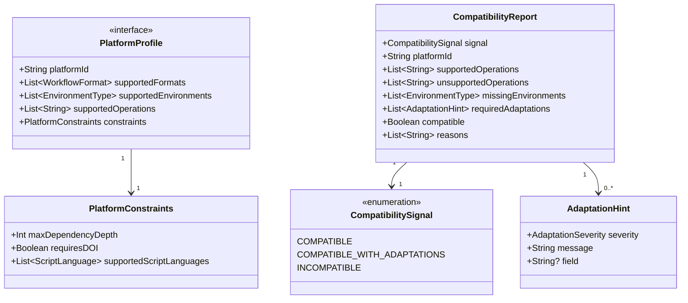

# Platform Profile

[`PlatformProfile`](../lib/src/main/kotlin/carp/interfaces/api/ConsumptionInterface.kt) is the interface a platform implements to declare its capabilities to the interoperability layer.
It answers the question: _what can this platform actually execute?_

A profile is consumed by `CompatibilityEvaluator` when responding to `checkCompatibility` calls.
Implementations should describe current, real capabilities — not aspirational ones.

## Object model

## PlatformProfile

Implemented by each participating platform to advertise its runtime capabilities.

| Property                | Type                    | Description                                                                                         |
|-------------------------|-------------------------|-----------------------------------------------------------------------------------------------------|
| `platformId`            | `String`                | Stable identifier for the platform (e.g. `carp-dsp`, `aware-rapids`)                                |
| `supportedFormats`      | `List<WorkflowFormat>`  | Workflow formats that the platform can execute or consume directly                                  |
| `supportedEnvironments` | `List<EnvironmentType>` | Environment types the platform can provision or execute                                             |
| `supportedOperations`   | `List<String>`          | Operation names natively supported (matched against `WorkflowArtifactPackage` operation references) |
| `constraints`           | `PlatformConstraints`   | Hard bounds on dependency depth, DOI requirements, and script support                               |

### PlatformConstraints

Operational limits that bound compatibility evaluation and dependency resolution.

| Field                      | Type                   | Required | Description                                                              |
|----------------------------|------------------------|:--------:|--------------------------------------------------------------------------|
| `maxDependencyDepth`       | `Int`                  |   Yes    | Maximum number of transitive dependency levels the platform will resolve |
| `requiresDOI`              | `Boolean`              |   Yes    | Whether the platform requires a DOI before accepting a package           |
| `supportedScriptLanguages` | `List<ScriptLanguage>` |          | Script languages the platform can execute (default: empty)               |

## Compatibility types

These types are produced by [`CompatibilityEvaluator`](compatibility-evaluator.md) and returned via `ConsumptionInterface.checkCompatibility`.
For evaluation rules and signal derivation logic, see [docs/compatibility-evaluator.md](compatibility-evaluator.md).

### CompatibilityReport

A structured report comparing a `WorkflowArtifactPackage` against a `PlatformProfile`.

| Field                     | Type                    | Description                                                                                                                         |
|---------------------------|-------------------------|-------------------------------------------------------------------------------------------------------------------------------------|
| `signal`                  | `CompatibilitySignal`   | Overall compatibility verdict                                                                                                       |
| `platformId`              | `String`                | The platform this report was evaluated against                                                                                      |
| `supportedOperations`     | `List<String>`          | Operations in the package that the platform supports                                                                                |
| `unsupportedOperations`   | `List<String>`          | Operations in the package that the platform cannot execute                                                                          |
| `missingEnvironments`     | `List<EnvironmentType>` | Environment types required by the package but absent from the platform                                                              |
| `requiredAdaptations`     | `List<AdaptationHint>`  | Structured hints describing each required adaptation                                                                                |
| `compatible` _(computed)_ | `Boolean`               | `true` when `signal` is not `INCOMPATIBLE`. Legacy convenience — prefer `signal`                                                    |
| `reasons` _(computed)_    | `List<String>`          | Human-readable summary derived from `requiredAdaptations` and unsupported fields. Legacy convenience — prefer the structured fields |

### CompatibilitySignal

Three-state verdict for a compatibility evaluation.

| Value                         | Description                                                             |
|-------------------------------|-------------------------------------------------------------------------|
| `COMPATIBLE`                  | The package can run on the platform as-is                               |
| `COMPATIBLE_WITH_ADAPTATIONS` | The package can run but requires adaptations; see `requiredAdaptations` |
| `INCOMPATIBLE`                | The package cannot run on the platform                                  |

### AdaptationHint

Describes a single required adaptation, with enough structure for a platform to act on it programmatically.

| Field      | Type                 | Required | Description                                                                                         |
|------------|----------------------|:--------:|-----------------------------------------------------------------------------------------------------|
| `severity` | `AdaptationSeverity` |   Yes    | How blocking this adaptation is (see [`AdaptationSeverity`](workflow-models.md#adaptationseverity)) |
| `message`  | `String`             |   Yes    | Human-readable description of what needs to change                                                  |
| `field`    | `String?`            |          | The specific field or operation the hint applies to                                                 |
