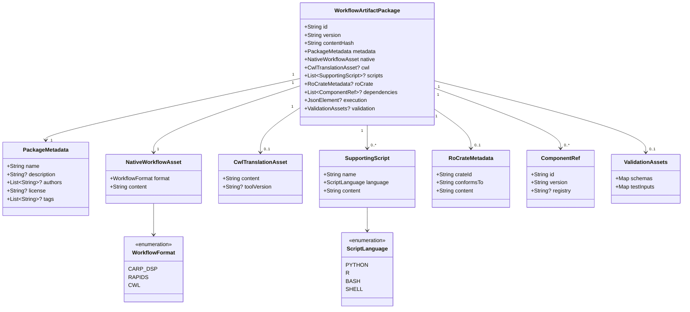

# Workflow Models

Defines all shared domain model types used to represent and exchange computational workflows between platforms.
All types are defined in [`WorkflowModels.kt`](../lib/src/main/kotlin/health/workflows/interfaces/model/WorkflowModels.kt) and annotated with `@Serializable` for JSON exchange using [`kotlinx.serialization`](https://github.com/Kotlin/kotlinx.serialization).

## Object model

## WorkflowArtifactPackage

[`WorkflowArtifactPackage`](../lib/src/main/kotlin/health/workflows/interfaces/model/WorkflowModels.kt) is the portable unit of exchange between platforms.
It bundles a workflow definition in its native format alongside optional translations, supporting scripts, open science metadata, dependency declarations, and an optional execution snapshot.

| Field          | Type                      | Required | Description                                                                               |
|----------------|---------------------------|:--------:|-------------------------------------------------------------------------------------------|
| `id`           | `String`                  |   Yes    | Unique identifier for this workflow package                                               |
| `version`      | `String`                  |   Yes    | Version string (e.g. `1.0.0`)                                                             |
| `contentHash`  | `String`                  |   Yes    | SHA-256 hash of the package contents for integrity verification                           |
| `metadata`     | `PackageMetadata`         |   Yes    | Descriptive metadata (name, authors, license, tags)                                       |
| `native`       | `NativeWorkflowAsset`     |   Yes    | The workflow in its original platform format                                              |
| `cwl`          | `CwlTranslationAsset?`    |          | Translation to [Common Workflow Language](https://www.commonwl.org/)                      |
| `scripts`      | `List<SupportingScript>?` |          | Supporting scripts required by the workflow                                               |
| `roCrate`      | `RoCrateMetadata?`        |          | [RO-Crate](https://www.researchobject.org/ro-crate/) metadata for open science registries |
| `dependencies` | `List<ComponentRef>?`     |          | References to other packages this workflow depends on                                     |
| `execution`    | `JsonElement?`            |          | Optional execution snapshot (platform-specific, stored as raw JSON)                       |
| `validation`   | `ValidationAssets?`       |          | Schemas and test inputs for validating the workflow                                       |

## Supporting types

### PackageMetadata

Descriptive metadata about a workflow package.

| Field | Type | Required | Description |
|---|---|:---:|---|
| `name` | `String` | Yes | Human-readable name of the workflow |
| `description` | `String?` | | Short description of what the workflow does |
| `authors` | `List<String>?` | | Author names or identifiers |
| `license` | `String?` | | License identifier (e.g. `MIT`, `Apache-2.0`) |
| `tags` | `List<String>?` | | Keywords for discovery and search |

### NativeWorkflowAsset

The workflow definition in the originating platform's format.

| Field | Type | Required | Description |
|---|---|:---:|---|
| `format` | `WorkflowFormat` | Yes | The format of the workflow content |
| `content` | `String` | Yes | The raw workflow definition (YAML, JSON, etc.) |

### CwlTranslationAsset

A translation of the workflow to [Common Workflow Language](https://www.commonwl.org/), enabling execution on CWL-compatible platforms.

| Field | Type | Required | Description |
|---|---|:---:|---|
| `content` | `String` | Yes | The CWL document as a string |
| `toolVersion` | `String?` | | CWL version used (e.g. `v1.2`) |

### SupportingScript

A script file bundled alongside the workflow definition.

| Field | Type | Required | Description |
|---|---|:---:|---|
| `name` | `String` | Yes | Filename of the script |
| `language` | `ScriptLanguage` | Yes | Programming language of the script |
| `content` | `String` | Yes | The script source code |

### RoCrateMetadata

Metadata for packaging the workflow as an [RO-Crate](https://www.researchobject.org/ro-crate/) for submission to open science registries such as [WorkflowHub](https://workflowhub.eu/).

| Field | Type | Required | Description |
|---|---|:---:|---|
| `crateId` | `String` | Yes | Identifier for the RO-Crate (typically a URL or DOI) |
| `conformsTo` | `String` | Yes | URL of the profile this crate conforms to |
| `content` | `String` | Yes | The `ro-crate-metadata.json` content as a string |

### ComponentRef

A reference to another `WorkflowArtifactPackage` that this workflow depends on.

| Field | Type | Required | Description |
|---|---|:---:|---|
| `id` | `String` | Yes | Identifier of the dependency |
| `version` | `String` | Yes | Required version of the dependency |
| `registry` | `String?` | | Registry URL where the dependency can be resolved (defaults to the same registry) |

### ValidationAssets

Schemas and test inputs for validating workflow inputs and outputs.

| Field | Type | Required | Description |
|---|---|:---:|---|
| `schemas` | `Map<String, String>?` | | JSON schemas keyed by port name |
| `testInputs` | `Map<String, String>?` | | Example input values keyed by port name |

## Enumerations

### WorkflowFormat

Identifies the native format of a workflow definition.

| Value | Description |
|---|---|
| `CARP_DSP` | CARP Data Science Pipeline YAML format |
| `RAPIDS` | Aware/RAPIDS workflow format |
| `CWL` | Common Workflow Language |

### EnvironmentType

Identifies the type of execution environment a workflow step requires.

| Value | Description |
|---|---|
| `CONDA` | Conda environment managed via `environment.yml` |
| `PIXI` | Pixi environment managed via `pixi.toml` |
| `R` | R environment (version declared in workflow) |
| `SYSTEM` | Uses the system-installed runtime; no environment manager |
| `DOCKER` | Docker container image |

### ScriptLanguage

Identifies the programming language of a `SupportingScript`.

| Value | Description |
|---|---|
| `PYTHON` | Python script |
| `R` | R script |
| `BASH` | Bash shell script |
| `SHELL` | Generic POSIX shell script |

### AdaptationSeverity

Indicates the severity of a compatibility issue reported by `CompatibilityEvaluator`.

| Value | Description |
|---|---|
| `BLOCKING` | The workflow cannot run on the target platform without modification |
| `WARNING` | The workflow can run but may behave differently or require manual steps |
| `INFO` | Informational note; no impact on execution |
